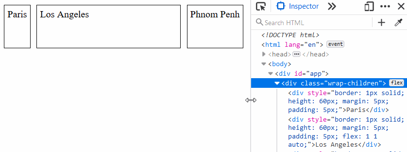

# flex-wrap-layout

[](https://www.npmjs.com/package/flex-wrap-layout)
[](https://github.com/tkrotoff/flex-wrap-layout/actions)

Detects flex-wrap via JavaScript ([unfortunately not possible in CSS](https://stackoverflow.com/q/40012428)).

[`detectRowWrap()`](src/detectRowWrap.ts) and [`useDetectRowWrap()`](src/useDetectRowWrap.ts) are JavaScript functions that detect when elements are wrapped and let you [define the CSS](src/detectRowWrap.scss) that goes with it.

This allows for responsive UIs without hardcoded CSS (width, min-width, media queries...) using the "natural" width of elements instead.

- With `detectRowWrap()`:



- Without:


## Usage

`npm install flex-wrap-layout`

```JS
import React, { useRef } from 'react';
import ReactDOM from 'react-dom';

import { useDetectRowWrap, wrapChildrenClassName } from 'flex-wrap-layout';
import 'flex-wrap-layout/src/detectRowWrap.scss';

const boxStyle = {
  border: '1px solid',
  height: 60,
  margin: 5,
  padding: 5
};

function MyComponent() {
  const ref = useRef(null);
  useDetectRowWrap(ref);

  return (
    <div ref={ref} className={wrapChildrenClassName}>
      <div style={boxStyle}>Paris</div>
      <div style={{ ...boxStyle, flex: 'auto' }}>Los Angeles</div>
      <div style={boxStyle}>Phnom Penh</div>
    </div>
  );
}

ReactDOM.render(<MyComponent />, document.getElementById('app'));
```

## Examples

- [Minimal example](examples/Minimal.tsx)
- [Boxes example](examples/Boxes.tsx)
- [Bootstrap 4 example](examples/Bootstrap4.tsx)

## Supported browsers

IE 11 and evergreen browsers
